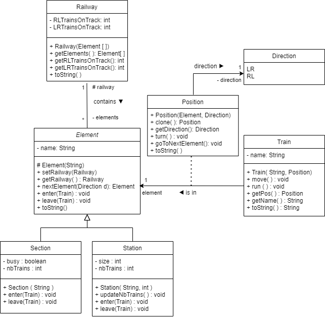

# **TP_Trains**

This code represents a simulation of trains running on a railway track consisting of different sections and stations.

## **Class Diagram**:

### **Overview of Each Component**:

1. **Train (Train.java)**  
   The `Train` class represents a train with a name and a position on the railway track. A train can move to the next element of the track. The simulation is managed in a thread using the `Runnable` interface.

2. **Element (Element.java)**  
   The `Element` class is an abstract class that represents different types of elements on the railway track, such as stations and sections. It handles the logic for moving trains between elements.

3. **Section (Section.java)**  
   The `Section` class, a concrete subclass of `Element`, represents a section of the railway track. It keeps track of whether the section is occupied by a train and how many trains are present.

4. **Station (Station.java)**  
   The `Station` class, a concrete subclass of `Element`, represents a station on the railway track. It has a maximum capacity for the number of trains it can accommodate and manages the entry and exit of trains.

5. **Position (Position.java)**  
   The `Position` class represents the position of a train on the railway track, characterized by an element and a direction (left to right or right to left). It allows the train to move to the next element.

6. **Direction (Direction.java)**  
   The `Direction` enumeration represents the direction of a train, either left to right (`LR`) or right to left (`RL`).

7. **Railway (Railway.java)**  
   The `Railway` class represents the complete railway circuit, consisting of elements like stations and sections. It also tracks the number of trains in each direction.

8. **BadPositionForTrainException (BadPositionForTrainException.java)**  
   This class is a custom exception that is thrown when a train is improperly positioned on the railway track.

---

## **Usage**:

To run the simulation, you can either:

- Run the `Main` class and observe the movement of the trains on the console.
- Run the `TrainSimulationApp` class to see the movement through a graphical user interface.

You can manipulate the elements of the track, such as the number of trains, stations, or sections, by modifying the `Main` or `TrainSimulationApp` classes to test the behavior of trains in various scenarios.

---

### **Requirements**:
- Java Development Kit (JDK) 8 or later.
- A development environment such as Eclipse, IntelliJ IDEA, or any IDE that supports Java.

Voici une brève explication de chaque composant du code.

## Train (Train.java)
La classe Train représente un train avec un nom et une position sur la voie ferrée. Un train peut se déplacer vers le prochain élément de la voie ferrée. La simulation est gérée dans un thread à l'aide de l'interface Runnable.

## Élément (Element.java)
La classe abstraite Element représente les différents types d'éléments sur la voie ferrée, tels que les stations et les sections. Elle gère la logique du déplacement des trains entre les éléments.

## Section (Section.java) 
La classe Section, une sous-classe concrète de la classe Element, représente une section de voie ferrée. Elle garde la trace de l'occupation de la section par les trains et du nombre de trains présents.

## Station (Station.java)
La classe Station, une sous-classe concrète de la classe Element,  représente une station sur la voie ferrée. Elle a une capacité maximale de trains qu'elle peut accueillir et gère l'entrée et la sortie des trains.

## Position (Position.java)
La classe Position représente la position d'un train sur la voie ferrée, caractérisée par un élément et une direction (de gauche à droite ou de droite à gauche). Elle permet au train de se déplacer vers le prochain élément.

## Direction (Direction.java) 
L'énumération Direction représente la direction d'un train, soit de gauche à droite (LR) soit de droite à gauche (RL).

## Voie ferrée (Railway.java)
La classe Railway représente le circuit complet de la voie ferrée, composé d'éléments tels que des stations et des sections. Elle gère également le suivi du nombre de trains dans chaque direction.

## BadPositionForTrainException (BadPositionForTrainException.java) 
Cette classe est une exception personnalisée qui est lancée lorsqu'un train est mal positionné sur la voie ferrée.

## Utilisation
Pour exécuter ce code vous pouvez soit exécuter la classe Main et visuliser le mouvement des train sur la console. Ou bien vous pouvez exécuter TrainSimulationApp pour voir le mouvement via l'interface graphique. Vous pouvez manipuler les éléments de la ligne, le nombre de trains, de gares ou de sections en modifiant les classes Main / TrainSimulationApp pour tester le comportement des trains dans différentes situations. 
